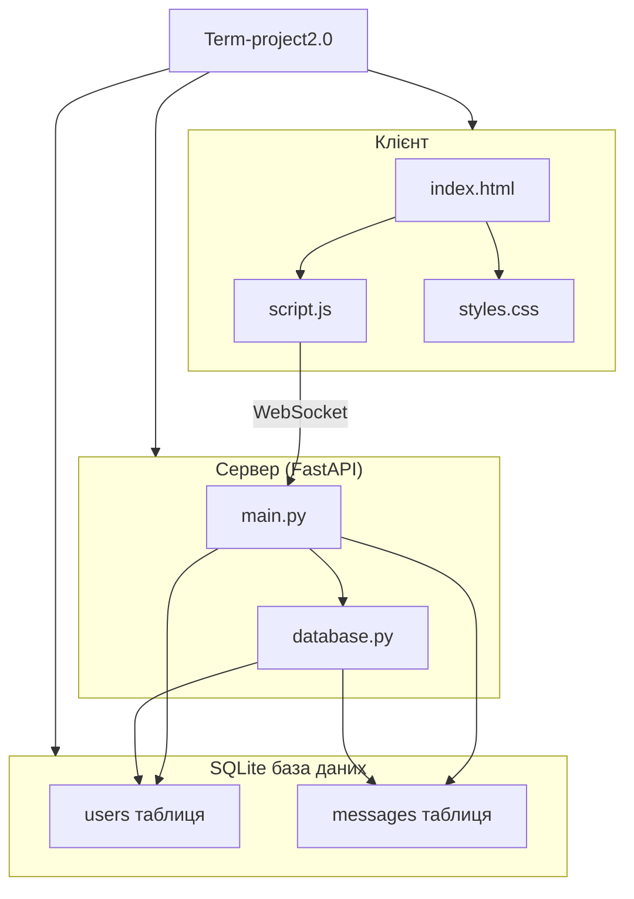

# Term-project2.0

## Опис проєкту

**Term-project2.0** — це веб-додаток для обміну особистими повідомленнями 1-на-1, створений як навчальний проєкт. Користувачі можуть спілкуватися в режимі реального часу через вебінтерфейс. Повідомлення передаються через WebSocket, а всі дані зберігаються в SQLite базі даних.

---

## ⚙️ Архітектура проєкту

Проєкт реалізований у вигляді клієнт-серверної архітектури з WebSocket для реального часу:

- **Клієнт:** HTML + JavaScript для відображення чату й підключення до WebSocket.
- **Сервер:** FastAPI, який обробляє WebSocket-з'єднання для обміну повідомленнями.
- **База даних:** SQLite — зберігає інформацію про користувачів і повідомлення.

---

## 🧩 Структура проєкту

| Файл / Директорія | Опис                                   |
|------------------|---------------------------------------|
| `main.py`        | Основний сервер FastAPI з WebSocket   |
| `database.py`    | Функції для роботи з SQLite базою     |
| `index.html`     | Веб-інтерфейс чату                    |
| `script.js`      | Логіка WebSocket та відображення чату |
| `styles.css`    | Стилі інтерфейсу                      |

---

## 🔄 Основний функціонал

- Підключення користувачів з ручним введенням ніку (автоматична генерація ніку тимчасово не працює).
- Миттєвий обмін повідомленнями 1-на-1 через WebSocket.
- Збереження повідомлень з міткою часу та статусом.
- Відображення історії повідомлень у чаті.

---

## 📚 Документація проєкту

| Компонент | Опис                                                    |
|-----------|---------------------------------------------------------|
| **Клієнт** | HTML/JS інтерфейс, підключення до WebSocket для реального часу. |
| **Сервер** | FastAPI — обробка WebSocket-з'єднань та логіка повідомлень.      |
| **База даних** | SQLite з таблицями `users` і `messages` для збереження історії. |
| **Аналітика** | Планується Python-скрипт для збору статистики активності.     |

---

## 📊 Архітектура проєкту (Mermaid-діаграма)

