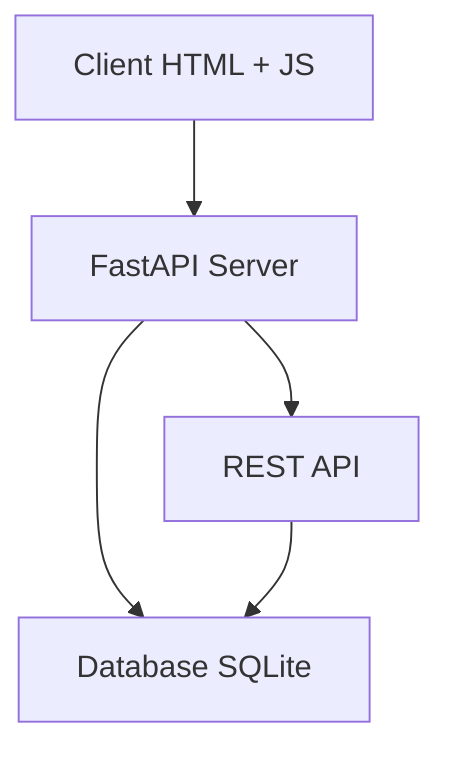

## Опис проєкту

**Term-project2.0** — це веб-додаток для обміну особистими повідомленнями 1-на-1, створений як навчальний проєкт. Користувачі можуть спілкуватися в режимі реального часу через вебінтерфейс. Повідомлення передаються через WebSocket, а всі дані зберігаються в SQLite базі даних.

---

## ⚙️ Архітектура проєкту

Проєкт реалізований у вигляді клієнт-серверної архітектури з WebSocket для реального часу:

- **Клієнт:** HTML + JavaScript для відображення чату й підключення до WebSocket
- **Сервер:** FastAPI-основа, обробляє REST-запити і WebSocket-з'єднання
- **База даних:** SQLite — зберігає інформацію про користувачів і повідомлення

---

## 🧩 Структура проєкту

| Файл / Директорія | Опис |
|------------------|------|
| `main.py`        | Основний сервер FastAPI з REST і WebSocket |
| `database.py`    | Функції для роботи з SQLite базою |
| `index.html`     | Веб-інтерфейс чату |
| `script.js`      | Підключення до WebSocket, логіка відображення |
| `styles.tcss`    | Стилі інтерфейсу (буде перейменовано в `styles.css`) |
| `.gitattributes` | Git-системний файл |
| `analytics.ipynb`| 📊 (планується) Аналіз активності з бази даних |

---

## 🔄 Основний функціонал

- Реєстрація користувачів (автоматично або вручну)
- Миттєвий обмін повідомленнями між двома користувачами через WebSocket
- Збереження повідомлень з міткою часу та статусом
- Відображення історії чату на клієнтському інтерфейсі

---

## 📚 Документація проєкту

| Компонент | Опис |
|-----------|------|
| **Клієнт** | HTML/JS вебінтерфейс. Підключається до WebSocket для прийому та надсилання повідомлень. |
| **Сервер** | FastAPI. Реалізовано WebSocket-з'єднання та REST для реєстрації/авторизації. |
| **База даних** | SQLite. Таблиці: `users`, `messages`. Зберігається історія, таймстемпи, статуси. |
| **Аналітика** | Python-скрипт (планується). Збір статистики про кількість повідомлень, активність по часу. |

---

## 📊 Mermaid-діаграма (Архітектура)

## 📊 Архітектура проєкту

